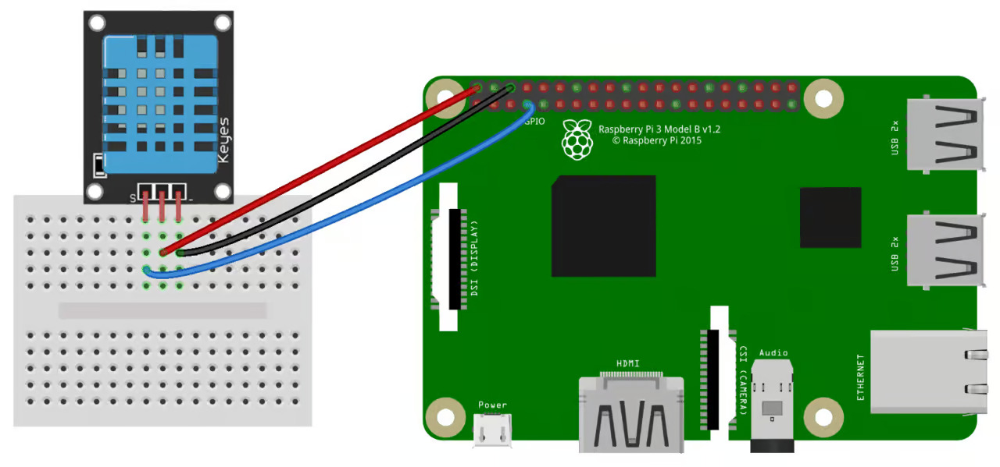

# DH11 Sensor Reading

This demo shows how to control an DH11 Sensor  connected to Raspberry Pi GPIO pins from a web page using Flask.

## Circuit



## Setup

```bash
cd demos/dh11_sensor
python3 -m venv ../venv
source ../venv/bin/activate
pip install flask RPi.GPIO
python app.py
```
