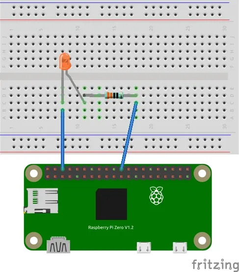

# LED Control Demo

This demo shows how to control an LED connected to Raspberry Pi GPIO pins from a web page using Flask.

## Circuit

- LED anode -> GPIO17 (Pin 11)
- LED cathode -> 220Ω resistor -> GND (Pin 6)



## Setup

```bash
cd demos/led
python3 -m venv ../venv
source ../venv/bin/activate
pip install flask RPi.GPIO
python app.py
